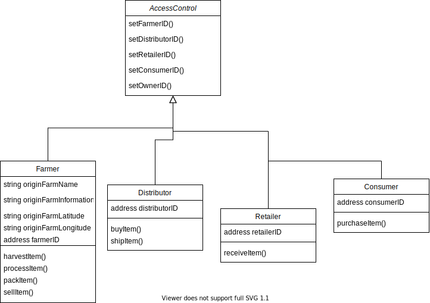
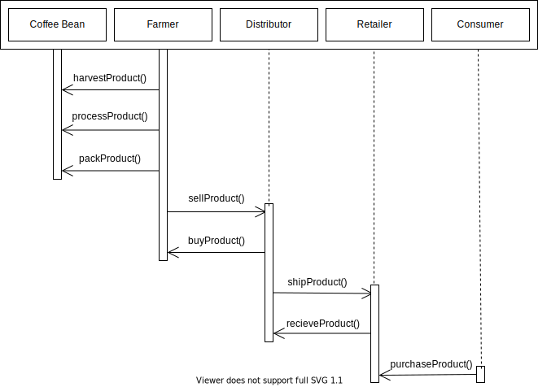
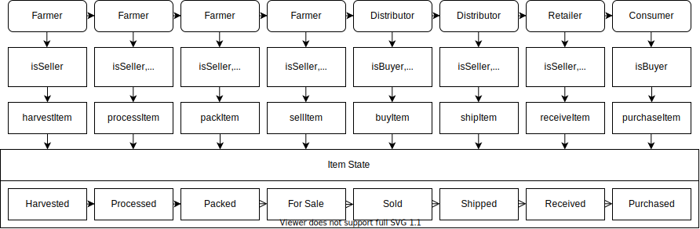

# Farmer DAPP
Decentralized supply chain application built on the Ethereum network using solidity smart contracts. Program allows for farmers, distributors, retailers, and consumers to seamlessly interact over the block chain.

This application is currently deployed to the Rinkeby Ethereum test network. Contract address is `0x80cbC9519A98Ab7B9A7628569619cF962C5286a6` and transaction hash is `0x7e295395edf832614eccdb535436ea0200399884544c4c4de8b3dc686e539648`.

## Getting Started
Instructions to get the Farmer DAPP installed and running on your local machine.

### Prerequisites
In order to run this project on your local machine, you will need:

* A [MetaMask](https://metamask.io/) account installed on your browser.
* [Truffle](https://trufflesuite.com/) installed on your machine. This can be done by installing globally with npm.

```
> npm install -g truffle
```

* [NodeJS](https://nodejs.org) installed on your local machine.

### Installing
To run a local instance of the project, you must first install project files and dependencies. To get started doing this, use the `git clone` command to clone the repository to your local machine:

```
> git clone https://github.com/hicks8989/farmer-dapp
```

Next, change to the project root directory:

```
> cd farmer-dapp
```

Then install project dependencies:

```
> npm install
```

Finally, compile Solidity smart contracts:

```
> truffle compile
```

### Configuration
In order to get your own instance of the StarNotary DAPP running, certain configuration variables must be set:

* Create a secret file called `.secret` in the root directory and insert the mnemonic for your metamask account.
* Set the infuraKey variable in the `truffle-config` file to your infura project key.

### Running
In order to run the application, the front and back ends must be run seperately.

Instructions for setting up each are below:

#### Front End
The front end uses `lite-server` to run a local application on your machine. In order to run this server, run the `npm run dev` command.

```
> npm run dev
```

#### Back End
The back end is run using `Truffle Suite` in order to run a local private blockchain. In order to run this instance the user must:

1. Change to the truffle development console.

```
> truffle develop
```

2. Compile contracts.

```
truffle (develop)> compile
```

3. Migrate contracts to be made available for the front end.

```
truffle (develop)> migrate --reset
```

### Deployment
In order to deploy your own instance of the project, you will need to:

1. Create a project in [Infura](infura.io).
2. Get the project ID for your network of choice.
3. Update the `truffle-config.js` file with your network settings and project ID.
4. Make sure you are on a MetaMask account with enough ether for the network of choice and migrate the files.

```
> truffle migrate --reset --network <network>
```

### Testing
In order to run tests for the project, you will need to:

1. Make sure all contracts have been compiled and migrated with the truffle terminal.

```
> truffle develop
truffle(develop)> compile
truffle(develop)> migrate --reset
```

2. Run the truffle test command.

```
truffle(develop)> test
```

## Layout
Application is built to allow farmers, distributrors, retailers, and consumers to seamlessly interact over the blockchain:

### Activity Diagram


### Data Model Diagram


### Sequence Diagram



### State Diagram


## Built With
* [Ethereum](https://ethereum.org/) - Ethereum is a decentralized platform that runs smart contracts.
* [Truffle](https://www.trufflesuite.com/) - Truffle is the most popular development framework for Ethereum with a mission to make your life a whole lot easier.
* [NodeJS](https://www.nodejs.org/) - Node.js is an open-source, cross-platform, JavaScript runtime environment that executes JavaScript code outside a web browser.